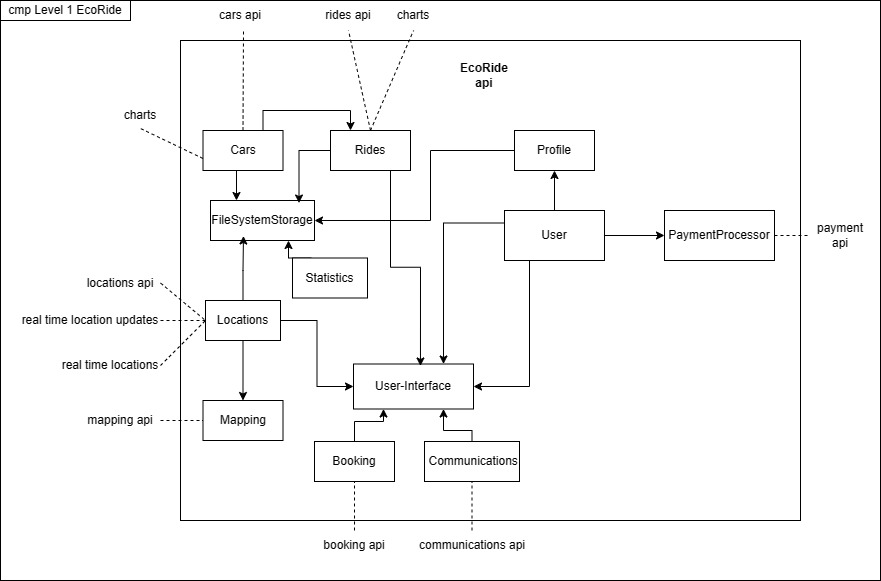
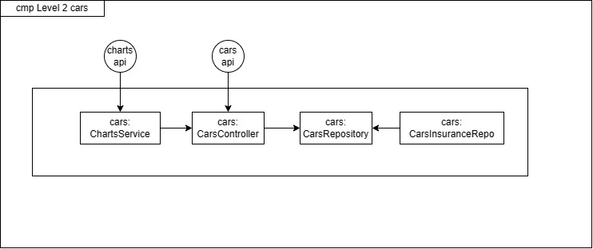
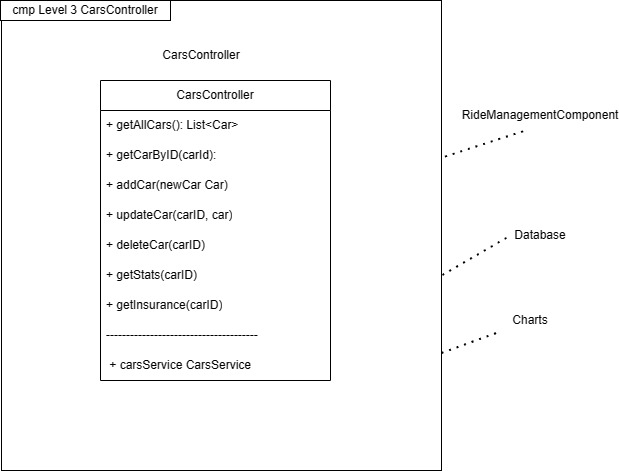
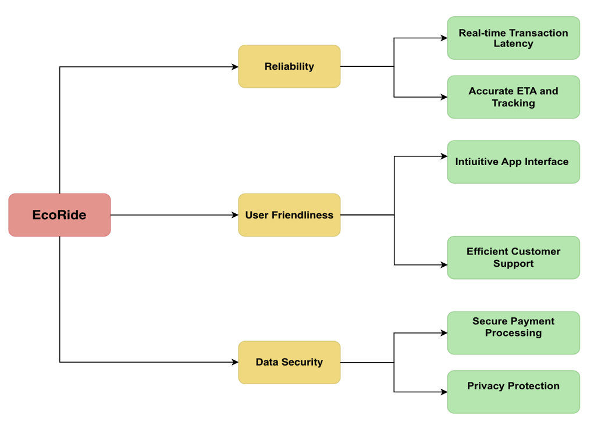

# 

# RideShare: EcoRide

# Introduction and Goals

<!-- (Describes the relevant requirements and the driving forces that software architects and development team must consider. These include)-->

EcoRide aims to provide its customers with a convenient, safe, and environmentally friendly mode of transportation for seamless, efficient, and eco-conscious travel from point A to point B.

The subsequent paragraphs delve into our architecture and elaborate on the various aspects and solutions contributing to these goals

### Essential features of the System
    - Easy and intuitive booking of a ride from A to B via the web, app, or mobile
    - Real-time driver tracking
    - Registration and  verification of drivers and passengers
    - Create and edit profiles
    - User feedback, support and rating system
    - Integrated payment system
    - Reporting and analytics features

### Business Goals
- Our Business Goals include
    - Ensuring seamless and accessible ride bookings, to offer a consistently dependable user experience
    - Emphasis on sustainability and adopting eco-friendly practices to reduce emissions, promote electric shared mobility solutions, and actively contribute to a greener and more sustainable future
    - Strong focus on data security
    - Advanced Safety measures to safeguard the well-being of our riders and drivers, ensuring their trust in our platform 

### Essential functional requirements
- These outlined functional requirements serve as a foundation for the development of our EcoRide app. They aim to provide a fast and secure mode of transportation while ensuring a user-friendly and efficient experience for our users.

    - User Registration and Profile Management
        - Allow users to register for the service, providing necessary personal information
        - Enable users to create and edit their profiles, including name, contact details, and profile picture
    - Ride Booking
        - A System that enables users to book rides from point A to point B
        - The booking process has to be accessible through the web, mobile and app
    - User Verification
        - Verification system for both drivers and passengers to enhance platform safety and trust
        - Verification may include identity checks, driver's license verification, and other relevant measures
    - Real-time Driver Tracking
        - Provide real-time driver tracking features, allowing passengers to track the driver's location and receive estimated arrival times (ETA)
    - Profile Creation and Editing
        - Allow users to create and edit their profiles, including personal details and profile pictures, to personalize their accounts
    - Feedback, Support, and Rating System
        - A System that enables users to provide feedback, seek support, and ask questions
        - Includes a user-friendly rating system for passengers to rate drivers and vice versa
    - Integrated Payment System
        - A secure payment system for handling transactions between drivers and passengers
        - Support various payment methods to ensure convenience for users
    - Reporting and Analytics Features
        - Reporting and analytics functions to monitor the platform's performance and user activities
        - Gather data related to rides, earnings, user engagement, and other relevant information

[comment]: <> (Quality Goals for the architecture)
### Quality Goals

In EcoRide, we are committed to achieving three core quality goals:

    - Reliability
    - User-friendliness
    - Data Security

These pillars serve as the cornerstones of our mission to provide an exceptional and secure user experience

### Stakeholders
Our Stakeholders and their expectations are:
- Investors
     - As an investor, I want to support an innovative ride-sharing app that revolutionizes the existing model and provides users with a convenient, efficient, and sustainable way to get around
- Drivers
    - As a driver, I want to be able to use an efficient and user-friendly ride-sharing app to offer my services and generate additional income 
- Customers
    - As a customer, I want to be able to use a user-friendly ride-sharing app to travel conveniently, safely, quickly, and environmentally friendly from A to B
- Government & Authorities
    - As a government authority, I want to promote an environmentally friendly ride-sharing app to support sustainable mobility and reduce CO2 emissions in my region
 - Payment Providers
    - As a payment provider, I want the ride-sharing app to seamlessly integrate payment processing to provide its users with a smooth transaction experience

## Requirements Overview

| Requirements                |  Explanation |
|-----------------------------|---|
| Search for Rides            |  Allows passengers to search for available rides based on location, destination, and desired travel time |
| Book a Ride                 | Allows passengers to select and book a ride from the list of available rides  |
| Accept/Decline Ride Request | Allows drivers to view and accept or decline ride requests from passengers |
| Track Ride                  | Allows passengers and drivers to track the progress of the ride and monitor estimated arrival time |
| Complete Ride               | Allows passengers and drivers to confirm that the ride has been completed and process payment through the app |
| View Ride History           | Allows users to view their ride history, including details such as ride date, time, location, and payment information  |

## Quality Goals

| Priority   | Contact        | Expectations       |
|-------------|----------------|--------------------|
| *1* | *Reliability* | *Reliability is crucial for our car-sharing company, as it enhances customer trust in punctual and well-maintained vehicles, thus promoting a positive user experience and long-term customer loyalty.* |
| *2* | *User-friendliness* | *User-friendliness is a central quality goal for our car-sharing company, as it ensures that customers can effortlessly and intuitively use our services, leading to a positive user experience and increasing the attractiveness of our service* |
| *3* | *Data security* | *Data security is a primary quality objective for our car-sharing company, as it protects the confidentiality and integrity of sensitive user information, strengthens the trust of our customers, and simultaneously minimizes legal and financial risks.* |

## Stakeholders

| Role/Name   | Contact        | Expectations       |
|-------------|----------------|--------------------|
| *Investors* | *Maryam Patel* | *As an investor, I want to support an innovative ride-sharing app that revolutionizes the existing model and provides users with a convenient, efficient, and sustainable way to get around* |
| *Drivers* | *Amirah Rahman* | *As a driver, I want to be able to use an efficient and user-friendly ride-sharing app to offer my services and generate additional income* |
| *Customers* | *Megan Chen* | *As a customer, I want to be able to use a user-friendly ride-sharing app to travel conveniently, safely, quickly, and environmentally friendly from A to B* |
| *Government & Authorities* | *Raj Gupta, Javier Gomez* | *As a government authority, I want to promote an environmentally friendly ride-sharing app to support sustainable mobility and reduce CO2 emissions in my region*
| *Payment Providers* | *PayPal, Klarna* | *As a payment provider, I want the ride-sharing app to seamlessly integrate payment processing to provide its users with a smooth transaction experience* |

# Architecture Constraints

These constraints encompass various elements, from infrastructure choices to database selection and real-time data processing, all of which impact the way our software meets the needs of our users and stakeholders.

<!-- See [Architecture Constraints](https://docs.arc42.org/section-2/) in the arc42 documentation.-->

| Context | Decision | Consequences |
|---|---|---|
| Location independence, Budget friendly, Physical security and Data Security | We will use a Cloud Based Infrastructure to max out efficiency, reduce costs, increase agility, improve accessibility and enhance security | On demand scalability and flexibility, no upfront capital costs buying hardware, improved Data Security, Service availability in cloud infrastructure varies by provider and design, requiring a commitment to ensure consistent uptime. Third-party dependency, data transfer costs and security concern, no physical control over hardware |
| High Data Volume, Availability and Scalability and concerns | We will use a NoSQL Database to address scalability, flexibility, performance and cost efficiency concerns | Flexibility to use unstructured or semi-structured data, horizontal scalability, high read and write throughput, improved application performance and responsiveness. Flexibility can lead to data inconsistency, NoSQL may require careful planning to scale effectively, CAP theorem trade-offs can impact performance and/or strong consistency |
| Importance of Dynamic-Routing, Customer-Experience, Safety and Security | We will use Real Time Data Processing, to enable immediate analysis and response to incoming data | Immediate updates and responses to users, enables real time decision making, competitive advantage. Implementing real-time data processing features adds complexity, requires additional computational resources |

## Architecture Decisions

| Problem   | Considered Alternatives | Decision       |
|-------------|----------------|--------------------|
| *Which type of database?* | *SQL, Maria DB, Oracle* | *NoSQL: Cost-Effective, Scalability, High Availability, Compatibility with most Cloud Solution Services, Migration* |
| *What type of Infrastructure?* | *Cloud Based, On Premise Infrastructure, Edge Computing* | *Cloud Based: On demand scalability and flexibility, Cost-Effective, no upfront capital costs, pay-as-you-go model, Data Security, Availability* |
| *Which Data Process model?* | *Batch Processing, Stream Processing Model, Lambda Architecture* | *Real Time Data Processing: immediate updates and responses to users, enables real time decision making, competitive advantage.* |

## Risks and Technical Debt

| Risk/Technical Debt   | Description |
|-------------|----------------|
| *NoSQL Database & Real Time Data Processing* | *NoSQL databases, introduces challenges related to data consistency, complex queries, and developer learning curves. -Using ACID Transactions to maintain data consistency -By implementing a microservices-based architectural approach, we aim to ensure the horizontal scalability and elasticity of our processing system, allowing us to effortlessly handle growing data volumes and sudden spikes in demand efficiently.*  | 
| *Using Cloud Based Infrastructure* | *The shift to cloud-based infrastructure introduces risks such as service outages, cost unpredictability, and vendor dependencies. To effectively address these challenges, consider these key elements: -Traffic Testing: Ensure your system can handle variable traffic loads, from regular usage to peak demand. -Workload Planning: Optimize costs by accurately provisioning resources based on your application's needs. -Incident Response Planning: Develop a clear plan to swiftly respond to service outages or security incidents. -Security Audits: Regularly assess your IaaS security to identify and mitigate vulnerabilities. * | *Cloud Based: On demand scalability and flexibility, Cost-Effective, no upfront capital costs, pay-as-you-go model, Data Security, Availability* |
| *Dependency on Third-Party Services* | *Excessive dependence on external services, such as payment gateways and mapping APIs, may result in service interruptions and higher expenses. -Optimize Service Usage and Contracts: Actively monitor service usage to identify cost-saving opportunities and negotiate cost-effective contracts with service providers. -Prepare for Service Outages: Develop contingency plans to ensure business continuity during service outages, including strategies for graceful degradation and backup solutions.* | 

# System Scope and Context

**Contents**

System scope and context - as the name suggests - delimits your system
(i.e. your scope) from all its communication partners (neighboring
systems and users, i.e. the context of your system). It thereby
specifies the external interfaces.

If necessary, differentiate the business context (domain specific inputs
and outputs) from the technical context (channels, protocols, hardware).

**Motivation**

The domain interfaces and technical interfaces to communication partners
are among your system’s most critical aspects. Make sure that you
completely understand them.

**Form**

Various options:

-   Context diagrams

-   Lists of communication partners and their interfaces.

See [Context and Scope](https://docs.arc42.org/section-3/) in the arc42
documentation.

## Business Context

The following diagram provides a comprehensive view of the system's communication partners, their specific interactions, and the data exchanged with the system's environment:

## Technical Context

**Contents**

Technical interfaces (channels and transmission media) linking your
system to its environment. In addition a mapping of domain specific
input/output to the channels, i.e. an explanation which I/O uses which
channel.

**Motivation**

Many stakeholders make architectural decision based on the technical
interfaces between the system and its context. Especially infrastructure
or hardware designers decide these technical interfaces.

**Form**

E.g. UML deployment diagram describing channels to neighboring systems,
together with a mapping table showing the relationships between channels
and input/output.

**\<Diagram or Table>**

**\<optionally: Explanation of technical interfaces>**

**\<Mapping Input/Output to Channels>**

# Solution Strategy

Our Solution Strategy combines a Service-Oriented Architecture (SOA) with cloud-based infrastructure, ensuring scalability, reliability, and rapid development cycles

### Technology Decisions:

We are utilizing a Service-Oriented Architecture (SOA) with loosely coupled services, which enables efficient scaling of specific features in response to increased user traffic

A cloud-based infrastructure ensures system reliability, availability, and accelerated development and deployment cycles through fault isolation and redundancy

### Top-Level Decomposition:

The chosen microservices architectural pattern effectively decomposes the system into manageable, loosely coupled services, allowing for specialized functionalities and easy scaling.

### Achieving Key Quality Goals:

Scalability is achieved through SOA, enabling seamless resource allocation to handle escalating user traffic while minimizing performance impact.

The combination of SOA and a cloud-based infrastructure provides flexibility, reliability, and availability, supporting rapid development and deployment cycles, aligning with the goal of continuous integration and delivery.

<!--See [Solution Strategy](https://docs.arc42.org/section-4/) in the arc42
documentation.-->

# Building Block View

**Level 1**

**Level 2**

**Level 3**

## Whitebox Overall System

Here you describe the decomposition of the overall system using the
following white box template. It contains

-   an overview diagram

-   a motivation for the decomposition

-   black box descriptions of the contained building blocks. For these
    we offer you alternatives:

    -   use *one* table for a short and pragmatic overview of all
        contained building blocks and their interfaces

    -   use a list of black box descriptions of the building blocks
        according to the black box template (see below). Depending on
        your choice of tool this list could be sub-chapters (in text
        files), sub-pages (in a Wiki) or nested elements (in a modeling
        tool).

-   (optional:) important interfaces, that are not explained in the
    black box templates of a building block, but are very important for
    understanding the white box. Since there are so many ways to specify
    interfaces why do not provide a specific template for them. In the
    worst case you have to specify and describe syntax, semantics,
    protocols, error handling, restrictions, versions, qualities,
    necessary compatibilities and many things more. In the best case you
    will get away with examples or simple signatures.

***\<Overview Diagram>***

Motivation  
*\<text explanation>*

Contained Building Blocks  
*\<Description of contained building block (black boxes)>*

Important Interfaces  
*\<Description of important interfaces>*

Insert your explanations of black boxes from level 1:

If you use tabular form you will only describe your black boxes with
name and responsibility according to the following schema:

| **Name**         | **Responsibility** |
|------------------|--------------------|
| *\<black box 1>* |  *\<Text>*         |
| *\<black box 2>* |  *\<Text>*         |

If you use a list of black box descriptions then you fill in a separate
black box template for every important building block . Its headline is
the name of the black box.

### \<Name black box 1>

Here you describe \<black box 1> according the the following black box
template:

-   Purpose/Responsibility

-   Interface(s), when they are not extracted as separate paragraphs.
    This interfaces may include qualities and performance
    characteristics.

-   (Optional) Quality-/Performance characteristics of the black box,
    e.g.availability, run time behavior, ….

-   (Optional) directory/file location

-   (Optional) Fulfilled requirements (if you need traceability to
    requirements).

-   (Optional) Open issues/problems/risks

*\<Purpose/Responsibility>*

*\<Interface(s)>*

*\<(Optional) Quality/Performance Characteristics>*

*\<(Optional) Directory/File Location>*

*\<(Optional) Fulfilled Requirements>*

*\<(optional) Open Issues/Problems/Risks>*

### \<Name black box 2>

*\<black box template>*

### \<Name black box n>

*\<black box template>*

### \<Name interface 1>

…

### \<Name interface m>

## Level 2

Here you can specify the inner structure of (some) building blocks from
level 1 as white boxes.

You have to decide which building blocks of your system are important
enough to justify such a detailed description. Please prefer relevance
over completeness. Specify important, surprising, risky, complex or
volatile building blocks. Leave out normal, simple, boring or
standardized parts of your system

### White Box *\<building block 1>*

…describes the internal structure of *building block 1*.

*\<white box template>*

### White Box *\<building block 2>*

*\<white box template>*

…

### White Box *\<building block m>*

*\<white box template>*

## Level 3

Here you can specify the inner structure of (some) building blocks from
level 2 as white boxes.

When you need more detailed levels of your architecture please copy this
part of arc42 for additional levels.

### White Box \<\_building block x.1\_\>

Specifies the internal structure of *building block x.1*.

*\<white box template>*

### White Box \<\_building block x.2\_\>

*\<white box template>*

### White Box \<\_building block y.1\_\>

*\<white box template>*

# Runtime View

## Ride Booking

The Runtime View of the ride-booking process visually outlines interactions among three entities: the User's Device with the App, the Server, and the Driver's Device. Users initiate the process by entering their destination (Step 1), leading to the server displaying ride options (Step 2). After confirming ride details (Step 3), the server sends a request to a driver (Step 4), followed by driver acceptance (Step 5). The server communicates confirmation and estimated arrival time to the user (Step 6). Successful ride booking (Step 7) and accurate arrival time (Step 8) conclude the process, emphasizing system responsiveness and seamless communication

## Real-Time Driver Tracking

The Runtime View of the Real-Time Driver Tracking captures the interaction dynamics involving a Passenger, the Ride-Sharing App, a Driver, and the GPS Service. It initiates with the Passenger activating real-time tracking in the app, triggering a sequence where the app requests real-time tracking from the Driver. Subsequently, the Driver seeks location data from the GPS Service, which is then relayed back to the Passenger through the app. Continuously updating the Estimated Time of Arrival (ETA), the EcoRide App ensures the Passenger remains informed about the Driver's location until the completion of the journey. The iterative process, marked by the condition 'until Driver Reaches Destination Location,' underscores the repetitive nature of these actions throughout the ride

## \<Runtime Scenario n>

# Deployment View

**Content**

The deployment view describes:

1.  technical infrastructure used to execute your system, with
    infrastructure elements like geographical locations, environments,
    computers, processors, channels and net topologies as well as other
    infrastructure elements and

2.  mapping of (software) building blocks to that infrastructure
    elements.

Often systems are executed in different environments, e.g. development
environment, test environment, production environment. In such cases you
should document all relevant environments.

Especially document a deployment view if your software is executed as
distributed system with more than one computer, processor, server or
container or when you design and construct your own hardware processors
and chips.

From a software perspective it is sufficient to capture only those
elements of an infrastructure that are needed to show a deployment of
your building blocks. Hardware architects can go beyond that and
describe an infrastructure to any level of detail they need to capture.

**Motivation**

Software does not run without hardware. This underlying infrastructure
can and will influence a system and/or some cross-cutting concepts.
Therefore, there is a need to know the infrastructure.

Maybe a highest level deployment diagram is already contained in section
3.2. as technical context with your own infrastructure as ONE black box.
In this section one can zoom into this black box using additional
deployment diagrams:

-   UML offers deployment diagrams to express that view. Use it,
    probably with nested diagrams, when your infrastructure is more
    complex.

-   When your (hardware) stakeholders prefer other kinds of diagrams
    rather than a deployment diagram, let them use any kind that is able
    to show nodes and channels of the infrastructure.

See [Deployment View](https://docs.arc42.org/section-7/) in the arc42
documentation.

## Infrastructure Level 1

Describe (usually in a combination of diagrams, tables, and text):

-   distribution of a system to multiple locations, environments,
    computers, processors, .., as well as physical connections between
    them

-   important justifications or motivations for this deployment
    structure

-   quality and/or performance features of this infrastructure

-   mapping of software artifacts to elements of this infrastructure

For multiple environments or alternative deployments please copy and
adapt this section of arc42 for all relevant environments.

***\<Overview Diagram>***

Motivation  
*\<explanation in text form>*

Quality and/or Performance Features  
*\<explanation in text form>*

Mapping of Building Blocks to Infrastructure  
*\<description of the mapping>*

## Infrastructure Level 2

Here you can include the internal structure of (some) infrastructure
elements from level 1.

Please copy the structure from level 1 for each selected element.

### *\<Infrastructure Element 1>*

*\<diagram + explanation>*

### *\<Infrastructure Element 2>*

*\<diagram + explanation>*

…

### *\<Infrastructure Element n>*

*\<diagram + explanation>*

# Cross-cutting Concepts

These cross-cutting concepts play a pivotal role in establishing and maintaining conceptual integrity, contributing to the consistency and homogeneity of our architecture and underpinning the inner qualities of our system

### *User Experience (UX)*

User Experience, often abbreviated as UX, focuses on creating a positive and seamless interaction between users and a digital product or service.

It encompasses various aspects, including the consistency of design and functionality, the representation of branding elements and logos, app navigation that ensures easy and intuitive user journeys, user authentication processes, push notifications for timely updates, geolocation and maps for location-based services, the flow for booking rides, payment processing, offline functionality to maintain usability without an internet connection, and a 5-star rating system with optional comments to gather user feedback. 

Additionally, it includes the recognition of driver achievements through medals, enhancing the overall user experience.

### Architecture and Design Patterns

The architecture and design of a digital application involve key decisions regarding the underlying technology and structure. 

This includes the use of a NoSQL database for flexible data storage, a Google Cloud-based infrastructure to ensure scalability and reliability, integration with Google Maps for location-related features. 

In addition payment gateways like PayPal and Klarna for secure and convenient transactions, the implementation of reusable components such as buttons, cards, and navigation bars for a consistent look and feel, and adherence to design guidelines like Material Design for Android and Human Interface Guidelines for iOS to provide a user-friendly and familiar interface.

### Safety and Security Concepts

Ensuring the safety and security of users' data and the application itself is paramount. 

This involves implementing data encryption techniques to protect sensitive information, establishing a robust data backup and recovery system to prevent data loss, complying with data privacy regulations such as the General Data Protection Regulation (DSVGO), creating an incident response plan to address security breaches and other emergencies effectively, and employing secure user authentication methods to prevent unauthorized access and maintain user privacy.

# Architecture Decisions

**Contents**

Important, expensive, large scale or risky architecture decisions
including rationales. With "decisions" we mean selecting one alternative
based on given criteria.

Please use your judgement to decide whether an architectural decision
should be documented here in this central section or whether you better
document it locally (e.g. within the white box template of one building
block).

Avoid redundancy. Refer to section 4, where you already captured the
most important decisions of your architecture.

**Motivation**

Stakeholders of your system should be able to comprehend and retrace
your decisions.

**Form**

Various options:

-   ADR ([Documenting Architecture
    Decisions](https://cognitect.com/blog/2011/11/15/documenting-architecture-decisions))
    for every important decision

-   List or table, ordered by importance and consequences or:

-   more detailed in form of separate sections per decision

See [Architecture Decisions](https://docs.arc42.org/section-9/) in the
arc42 documentation. There you will find links and examples about ADR.

# Quality Requirements

This section elaborates on the established quality goals of **Reliability**, 
**User-Friendliness**, and **Data Security**.  
The Quality Tree provides a detailed quality tree along with associated scenarios, encompassing both high-priority requirements essential for core objectives and additional quality measures with lower priority.

Each requirement is carefully tailored to address the specific and quantifiable expectations of stakeholders, providing a robust foundation for informed development and rigorous evaluation of our ride-sharing solution.

| Quality Requirements |  |  |
|---|---|---|
| Reliability |  |  |
| User-Friendliness |  |  |
| Data Security |  |  |

## Quality Tree

Our Quality Tree consists of the values reliability, user-friendliness, and data security. The leaves are: Real-time Transaction Latency, Accurate ETA and Tracking, Intuitive App Interface, Efficient Customer Support, Secure Payment Processor, and Privacy Protection. 

## Quality Scenarios

**Reliability**

Real-time Transaction Latency
A user initiates a ride booking transaction. Under normal operations the system maintains an average latency of two seconds or better for processing all ride booking transactions, consistently falling within the acceptable range of 1.5 to 2.5 seconds

Accurate ETA and Tracking
A user wants an accurate and reliable estimated time of arrival (ETA) and real-time tracking of drivers at runtime. 
The system consistently provides this information and checks the provided information with ride completion times, passenger feedback and tracking data, to confirm that the displayed ETAs align with actual arrival times

**User-friendliness**

Intuitive App Interface
A user wants to switch seamlessly between devices, sign in or register quickly and wants to request rides without manually entering their location.
The system provides a uniform, intuitive interface with a hamburger icon for additional settings. It requires only email and password for login and registration and auto-tracks the user's location for ride requests in a few seconds.

Efficient Customer Support
A user encounters an application error during the live-phase and seeks assistance. 
The system provides swift and efficient customer support which takes a maximum of 10 minutes, additionally the system includes a FAQ and live chat support, and automatically opens a new ticket for each issue.

**Data Security**

Privacy Compliance
The developer wants to adapt the system after data protection regulations have been breached or new laws have been passed. The system is updated to solve security measurements and undergoes weekly reviews to implement preventive measures. 

Secure Payment Processing
A user who conducts a payment transaction wants secure handling of the payment data. 
The system confirms secure processing of user payment data through robust encryption, weekly security audits and penetration testing 

# Risks and Technical Debts

**Contents**

A list of identified technical risks or technical debts, ordered by
priority

**Motivation**

“Risk management is project management for grown-ups” (Tim Lister,
Atlantic Systems Guild.)

This should be your motto for systematic detection and evaluation of
risks and technical debts in the architecture, which will be needed by
management stakeholders (e.g. project managers, product owners) as part
of the overall risk analysis and measurement planning.

**Form**

List of risks and/or technical debts, probably including suggested
measures to minimize, mitigate or avoid risks or reduce technical debts.

See [Risks and Technical Debt](https://docs.arc42.org/section-11/) in
the arc42 documentation.

# Glossary

**Contents**

The most important domain and technical terms that your stakeholders use
when discussing the system.

You can also see the glossary as source for translations if you work in
multi-language teams.

**Motivation**

You should clearly define your terms, so that all stakeholders

-   have an identical understanding of these terms

-   do not use synonyms and homonyms

A table with columns \<Term> and \<Definition>.

Potentially more columns in case you need translations.

See [Glossary](https://docs.arc42.org/section-12/) in the arc42
documentation.

| Term        | Definition        |
|-------------|-------------------|
| *\<Term-1>* | *\<definition-1>* |
| *\<Term-2>* | *\<definition-2>* |
